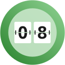

# Evento
Sailfish OS app to count remaining days to defined events.

>

## Translations
Available translations:

- English
- German
- French (by lambda2501)

If you missing your native language you are welcome to support this project with your translation.

[https://weblate.nubecula.org/engage/harbour-evento/](https://weblate.nubecula.org/engage/harbour-evento/)

## Donations

If you like my work, you can buy me a beer! 

